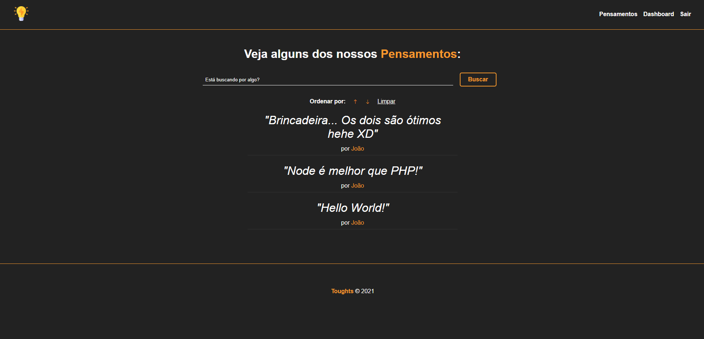

# Toughts

Esse projeto é um sistema básico onde o usuário tem a possibilidade de criar pensamentos que ficam expostos na página Home para que outras pessoas vejam.

Esse projeto faz parte do curso [Node.js do Zero a Maestria](https://www.udemy.com/course/nodejs-do-zero-a-maestria-com-diversos-projetos). O desenvolvimento foi feito pelo professor e eu fui acompanhando e replicando o código manualmente, com exceção do CSS. Considero essa uma ótima maneira de aprender pois consegui adquirir muito conhecimento técnico sobre desenvolvimento web de forma geral, trabalhando muito com CRUD e alguns recursos extras como a autenticação de um usuário no sistema, além do relacionamento entre tabelas MySQL.

Pretendo melhorar esse projeto no futuro com alguns recursos extras como Likes e Comentários nos pensamentos, mas por enquanto darei prioridade em outras tarefas e projetos.



## 🚀 Começando

Essas instruções permitirão que você obtenha uma cópia do projeto em operação na sua máquina local para fins de desenvolvimento e teste.

### 📋 Pré-requisitos

De que coisas você precisa para instalar o software e como instalá-lo?

```
Node v16.13.0
MySQL 8.0.27
MySQL Workbench (Opcional)
```

### 🔧 Instalação

Passos:

Criar banco de dados:

```
CREATE SCHEMA `toughts` ;
```

Instalar dependências necessárias para rodar o projeto:

```
npm install
```

Com as dependências instaladas e o banco criado, o Model se encarregará de criar as tabelas necessárias para o projeto.

## ⚙️ Executando

1 - Na pasta do projeto, execute:
```
node index.js
```
2 - Acesse: http://localhost:3000:

## ✒️ Autor

* **Leonardo Mazzeu** - *Único desenvolvedor* - [leomazzeu](https://github.com/leomazzeu)

---
By: [Léo Mazzeu](https://github.com/leomazzeu)  💙
